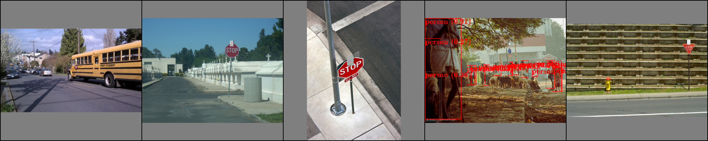
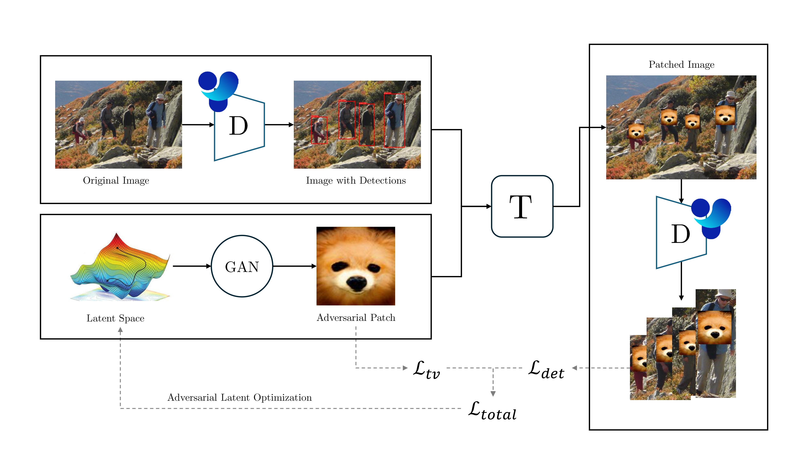
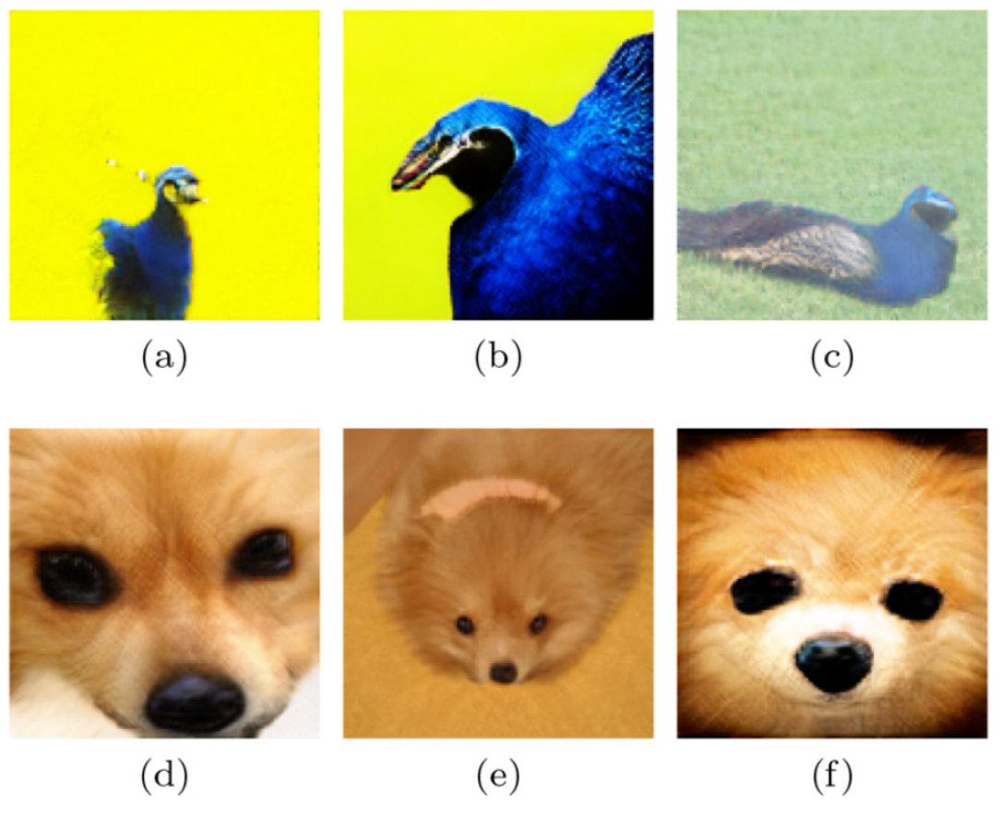
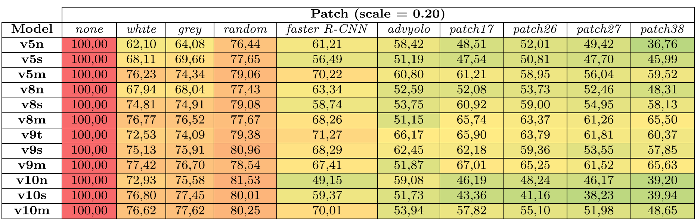

# Evaluating the Impact of Adversarial Patch Attacks on YOLO Models


Данный репозиторий содержит слегка доработанный код из следующего репозитория: https://github.com/Bimo99B9/NaturalisticAdversarialPatches.

Далее представлено руководство, как получилось запустить данную программу у меня. При этом использовались Windows 11, RTX4060Ti с CUDA 12.8, Python 3.11, Powershell 7

Ниже так же представлено оригинальное описание от авторов репозитория, которое говорит о том, как запустить данный код в docker. Можно попробовать согласно данному руководству развернуть как данную версию репозитория, так и оригинальную.


## Шаги для запуска

1. Установить python 3.11.
2. Создать и активировать venv
``` bash
python -m venv env
.\env\Scripts\activate.ps1
```
3. Установить pytorch
```bash
pip install torch torchvision torchaudio --index-url https://download.pytorch.org/whl/cu128 
```
4. Установить зависимости
```bash
pip install -r .\requirements.txt
```
5. Скачать датасет по [ссылке](https://drive.google.com/file/d/1qoxqzSZ6yN6JVE8AW_owMPgMU36YHC30/view?usp=drive_link) и распаковать его в корень проекта. При желании можно заменить датасет на собственный, в качестве примера разметки взяв датасет по ссылке.
6. Скачать веса GAN-модели скриптом:
```bash
bash .\GANLatentDiscovery\download_weights.sh
```
7. Запустить программу
```bash
python ensemble.py --model yolov8s --classBiggan 259 --epochs 100 --weight_loss_tv 0.1 --learning_rate 0.01
```
- model - указывает, какую модель мы атакуем, ниже расписано, какие модели принимает программа. Интересно, что программа берет модель с таким названием из корня проекта, то есть можно туда положить свою предобученную на конкретном датасете модель. При этом архитектура модели должна быть как у модели из названия.
- classBiggan - как будет выглядеть готовый патч (по крайней мере в теории). Ниже, опять же, можно найти, чему соответствуют значения классов. Эксперимент показал, что иногда готовый патч перестаёт выглядеть так, поэтому не совсем важно, что мы здесь выберем
- epochs - количество эпох генерации патча. Рекомендуемое авторами программы значение - 1000, но и на 100 итерациях удалось достичь крайне эффективного патча
- weight_loss_tv и learning_rate - типичные гиперпараметры обучения, в случае чего можно заняться их подбором, и что они значат так же описано ниже

Сгенерированные патчи будут храниться в папке exp/exp[номер итерации]/generated, там же каждые N эпох сохраняются примеры использования патча (N настраивается в файле ensemble.py, параметр называется epoch_save)

### Пример эффективности патча после 100 итераций


## Оригинальный readme

This repository contains the official implementation for the paper: **"Evaluating the Impact of Adversarial Patch Attacks on YOLO Models and the Implications for Edge AI Security"**, published in the *International Journal of Information Security*.

We evaluate the vulnerability of recent YOLO object detectors from the Ultralytics framework (YOLOv5, YOLOv8, YOLOv9, and YOLOv10) to naturalistic adversarial patch attacks. The patches are generated by optimizing the latent space of a pre-trained GAN, making them appear realistic while effectively fooling object detectors.

<br>

<p align="center">
  
  <br>
  <em><b>Figure 1:</b> The naturalistic adversarial patch generation process.</em>
</p>

---

## Abstract

Machine learning systems, despite their power, are vulnerable to adversarial attacks. This work evaluates the impact of such attacks on recent YOLO object detectors, focusing on **naturalistic adversarial patches**—realistic-looking patterns designed to make object detectors ignore or misclassify objects. We adapt a state-of-the-art patch generation method to create effective patches for **YOLOv5, YOLOv8, YOLOv9, and YOLOv10**. Our experiments, conducted on the INRIA and MPII datasets, show high success rates in evading detection. The results also indicate that larger models are generally more robust than their smaller counterparts, highlighting a critical security trade-off for resource-constrained Edge AI devices, which often rely on smaller, faster, but more vulnerable models.

---

## Key Features

- **State-of-the-Art Attacks:** Implementation of naturalistic adversarial patch attacks against the latest Ultralytics YOLO models.
- **YOLOv5, v8, v9, & v10 Support:** The framework has been adapted to use these modern YOLO versions as detectors during the patch generation phase.
- **Edge AI Security Analysis:** The paper and code explore the critical trade-off between model size, inference speed, and security, with specific experiments on edge devices.
- **Reproducibility:** A Dockerized environment is provided to ensure easy setup and consistent results.

---

## Generated Patch Examples

Here are some examples of the naturalistic adversarial patches generated by our method.

<p align="center">
  
  <br>
  <em><b>Figure 2:</b> Adversarial naturalistic patches generated using different models and classes (e.g., Peacock, Dog).</em>
</p>

---

## Installation

The easiest way to get started is by using the provided Docker container, which handles all dependencies.

### Prerequisites

-   NVIDIA GPU with drivers installed.
-   [Docker](https://docs.docker.com/get-docker/) installed on your system.
-   [NVIDIA Container Toolkit](https://docs.nvidia.com/datacenter/cloud-native/container-toolkit/latest/install-guide.html) for GPU support in Docker.

### Step 1: Clone the Repository

```bash
git clone [https://github.com/your-username/your-repo-name.git](https://github.com/your-username/your-repo-name.git)
cd your-repo-name
```

### Step 2: Build the Docker Image

Build the Docker image using the provided `Dockerfile`. This will install all necessary system libraries and Python packages.

```bash
docker build -t naturalistic-adversarial-patch .
```

### Step 3: Download Datasets

The experiments in the paper use the **INRIA Person** and **MPII Human Pose** datasets. A script is provided to download and set up the INRIA dataset.

```bash
bash download_inria.sh
```

This will create a `dataset/` directory and place the INRIA data inside.

### Step 4: Download Pretrained GAN Weights

The patch generation process relies on a pre-trained BigGAN model. Run the following script to download the necessary weights.

```bash
bash ./GANLatentDiscovery/download_weights.sh
```

The YOLO model weights are downloaded automatically by the `ultralytics` package when first used.

---

## How to Run

### Training an Adversarial Patch

To train a new adversarial patch, run the `ensemble.py` script inside the Docker container. You need to mount your local `dataset` and `exp` directories to the container to load data and save results.

The `run_train.sh` script provides several examples. Here is a generic command:

```bash
# General Training Command
docker run --gpus all --shm-size=4g \
    -v "$(pwd)/dataset:/usr/src/app/dataset" \
    -v "$(pwd)/exp:/usr/src/app/exp" \
    -it naturalistic-adversarial-patch \
    python ensemble.py \
        --model yolov5m \
        --classBiggan 259 \
        --epochs 1000 \
        --weight_loss_tv 0.1 \
        --learning_rate 0.01
```

**Key Arguments for `ensemble.py`:**

-   `--model`: The YOLO detector to use for training (e.g., `yolov5n`, `yolov5m`, `yolov8n`, `yolov9t`).
-   `--classBiggan`: The ImageNet class ID for the GAN to generate (e.g., 259 for Pomeranian, 84 for Peacock).
-   `--epochs`: Number of training epochs.
-   `--weight_loss_tv`: Weight for the total variation loss (promotes patch smoothness).
-   `--learning_rate`: The optimizer learning rate.

You can monitor the training progress using TensorBoard:

```bash
tensorboard --logdir=./exp
```

### Evaluating a Patch

To evaluate the effectiveness of a generated patch, use the `evaluation.py` script. The `run_eval_patch.sh` and `run_eval_all_patch.sh` scripts are provided to automate this process across multiple models.

1.  Place your generated patch (e.g., `patch17.png`) in a `patch/` directory.
2.  Run the evaluation script for a specific patch:

```bash
# Example: Evaluate 'exp17.png' on all target models
./run_eval_patch.sh exp17
```

This script will call `evaluation.py` for each YOLO model variant (v5, v8, v9, v10 in n, s, m sizes) and test the specified patch. Results, including mAP scores, will be processed by the scripts.

### Live Camera Demo

You can test the YOLO detector on a live camera feed by running `camera_test.py`.

```bash
# Make sure to mount the X11 socket to forward the display
xhost +local:docker

docker run --gpus all --rm -it \
    --env="DISPLAY" \
    --volume="/tmp/.X11-unix:/tmp/.X11-unix:rw" \
    naturalistic-adversarial-patch \
    python camera_test.py
```

---

## Results

Our experiments demonstrate that the generated patches are highly effective at evading detection, especially on smaller YOLO models commonly used in edge devices. For instance, our best-performing patches, **patch27** and **patch38**, achieved significant performance drops across all tested models.

<p align="center">
  
  <br>
  <em><b>Table 1:</b> mAP comparison of baseline patches vs. our best-generated patches on the INRIA dataset (scale 0.20). Darker colors indicate lower mAP and a more successful attack.</em>
</p>

The findings underscore a crucial vulnerability in modern object detectors and highlight the need for robust defense mechanisms, particularly as AI continues to move to the edge.

---

## Citation

If you use this work in your research, please cite our paper:

```bibtex
@article{Gala2025,
  author    = {Gala, D. L. and Molleda, J. and Usamentiaga, R.},
  title     = {Evaluating the Impact of Adversarial Patch Attacks on YOLO Models and the Implications for Edge AI Security},
  journal   = {International Journal of Information Security},
  year      = {2025},
  volume    = {24},
  number    = {3},
  pages     = {154},
  month     = {06},
  doi       = {10.1007/s10207-025-01067-3},
  url       = {[https://doi.org/10.1007/s10207-025-01067-3](https://doi.org/10.1007/s10207-025-01067-3)}
}
```

---

## Credits

This repository is built upon and extends the work from the original [Naturalistic-Adversarial-Patch](https://github.com/gordonjun2/Naturalistic-Adversarial-Patch) repository. Our work adapts it for modern Python/CUDA environments and extends its capabilities to the latest YOLO object detectors.

We also thank the authors of the following libraries and repositories:

-   **GANs**: [GANLatentDiscovery](https://github.com/anvoynov/GANLatentDiscovery)
-   **YOLO Models**: [adversarial-yolo](https://gitlab.com/EAVISE/adversarial-yolo), [PyTorch-YOLOv3](https://github.com/eriklindernoren/PyTorch-YOLOv3), [pytorch-YOLOv4](https://github.com/Tianxiaomo/pytorch-YOLOv4), and [Ultralytics](https://github.com/ultralytics/ultralytics).

